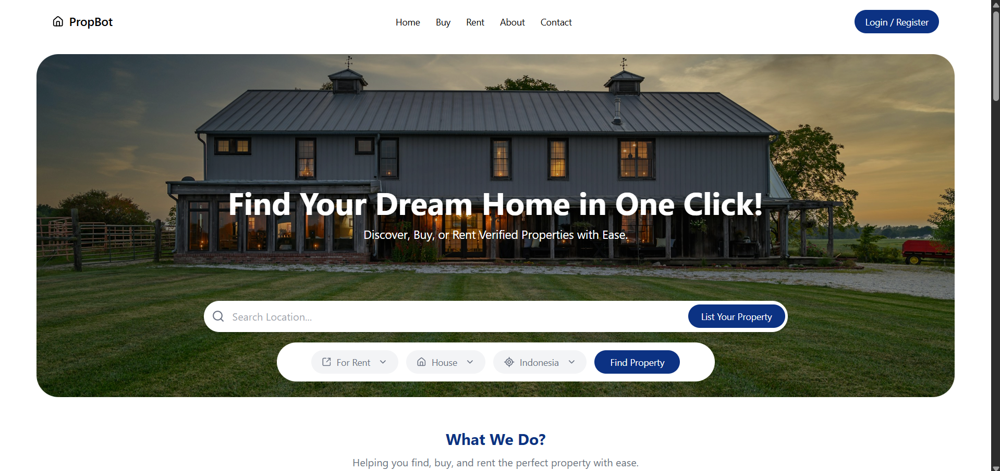
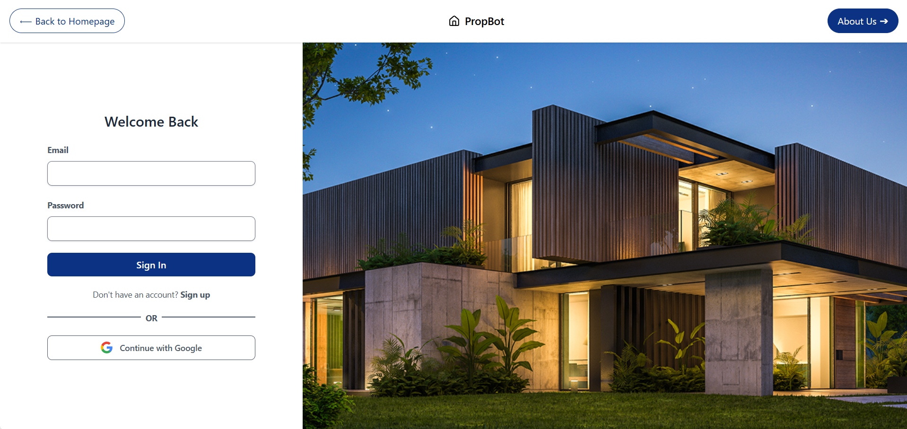

<h1 align="center"># 🛍️ Propbot – Full-Stack Housing Platform</h1>

PropBot is a modern full-stack cloud-based housing platform that streamlines the way users explore and manage real estate. Built with a Spring Boot backend and a Vite-powered React frontend, PropBot enables seamless property discovery, interaction, and management for both buyers and renters.
---

## 📚 Table of Contents

- [✨ Introduction](#-introduction)
- [🚀 Get Started](#-get-started)
  - [🛍️ Frontend Setup (React - Vite)](#-frontend-setup-react)
- [📂 Project Structure](#-project-structure)
- [🛠️ Technologies Used](#️-technologies-used)
- [🔗 Live Project](#-live-project)
---

## ✨ Introduction

Propbot is a modern housing platform that enables users to:

🏠 Browse & Search Properties – Explore houses, apartments, and rentals with advanced filtering.
👤 User Authentication – Securely register and log in to manage profiles and saved properties.
📌 Buy, Rent, or List Properties – Easily view listings, connect with property owners, or add new listings.
🛒 Personalized Dashboard – Track saved properties, manage interests, and view recent activity.
💬 Inquiries & Reviews – Send inquiries to sellers/owners and share feedback on properties.

It is composed of:
- A **React (Vite)** frontend hosted on **Netlify**

---

## 🚀 Get Started

### 📱 Frontend Setup (React - Vite)


1. Navigate to frontend directory:
   ```bash
   git clone https://github.com/quantambites/Web_HouseAssignment.git
   cd ecommerce/client
   ```

2. Install dependencies:
   ```bash
   npm install
   ```


3. Start the app:
   ```bash
   npm run dev
   ```

---


## 📂 Project Structure

```
Web_HouseAssignment (Propbot)/
│
├── src/              # React frontend (Firebase ready)
│
├── .gitignore
└── README.md
```

---

## 🛠️ Technologies Used

- **Frontend:** React + Vite +  Axios
- **Auth:** Firebase
- **Database:** Firebase


---
### 🔗 Live Project

[https://propbotassignment.netlify.app/shop/home](https://propbotassignment.netlify.app/shop/home)


<p align="center">
  
</p>

<p align="center">
  
</p>
